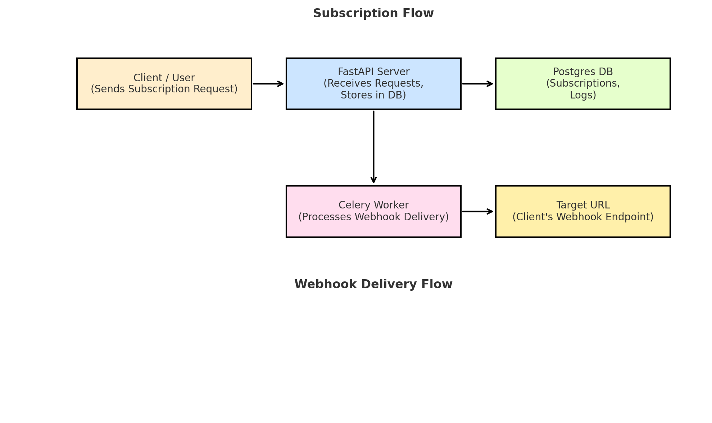

# Webhook Delivery Service

A robust backend system for ingesting, queuing, delivering, and monitoring webhooks.  
Built with FastAPI, PostgreSQL, Redis, Celery, and Docker Compose.  
Includes automatic retries with exponential backoff, delivery logging, and a minimal UI via Swagger/OpenAPI.

---

## Table of Contents

1. [Prerequisites](#prerequisites)  
2. [Project Structure](#project-structure)  
3. [Setup & Run Locally](#setup--run-locally)  
4. [Environment Variables](#environment-variables)  
5. [Docker Compose Services](#docker-compose-services)  
6. [API Documentation & UI](#api-documentation--ui)  
7. [Architecture Choices](#architecture-choices)  
8. [Database Schema & Indexing](#database-schema--indexing)  
9. [API Usage Examples (curl)](#api-usage-examples-curl)  
10. [Retry Strategy](#retry-strategy)  
11. [Log Retention Policy](#log-retention-policy)  
12. [Deployment on Render](#deployment-on-render)  
13. [Cost Estimation](#cost-estimation)  
14. [Assumptions](#assumptions)  
15. [Credits](#credits)  

---

## Prerequisites

- **Docker** & **Docker Compose**  
  - macOS: Install [Docker Desktop](https://www.docker.com/products/docker-desktop)  
- **Git** (for pushing to GitHub)  
- A terminal (bash, zsh, PowerShell, etc.)

---

## Project Structure

```
webhook_service/
├── app/
│   ├── api/
│   │   ├── ingest.py
│   │   ├── status.py
│   │   └── subscriptions.py
│   ├── __init__.py
│   ├── crud.py
│   ├── database.py
│   ├── main.py
│   ├── models.py
│   ├── schemas.py
│   └── utils.py
├── Dockerfile
├── docker-compose.yml
├── entrypoint.sh
├── requirements.txt
├── .env.example
└── README.md
```

---

## Setup & Run Locally

1. **Clone the repo**  
   ```bash
   git clone https://github.com/sarthaknitnaware/webhook_service.git
   cd webhook_service
   ```

2. **Create your environment file**  
   Copy the example and adjust if necessary:  
   ```bash
   cp .env.example .env
   ```

3. **Build and start all services**  
   ```bash
   docker-compose up --build
   ```

4. **Verify**  
   - FastAPI runs at → `http://localhost:8000`  
   - Swagger UI → `http://localhost:8000/docs`

---

## Environment Variables

File: `.env.example`  
```env
# PostgreSQL connection string for your local 'db' service
DATABASE_URL=postgresql://postgres:postgres@db:5432/webhooks

# Redis connection string for both cache and Celery broker
REDIS_URL=redis://redis:6379/0

# How many hours to retain delivery logs
LOG_RETENTION_HOURS=72
```

Copy this to `.env` (without `.example`) before starting.

---

## Docker Compose Services

| Service | Description                                  | Exposed Port |
|---------|----------------------------------------------|--------------|
| **app** | FastAPI application + Celery worker          | 8000 → 8000  |
| **db**  | PostgreSQL 15 database                       | 5432         |
| **redis** | Redis 7 (broker & cache)                   | 6379         |

Data persists in named Docker volumes: `db_data`, `redis_data`.

---

## API Documentation & UI

FastAPI auto-generates:

- **Swagger UI**: `http://localhost:8000/docs`  
- **ReDoc**:    `http://localhost:8000/redoc`  

Use these to explore and interact with:

- Subscription CRUD  
- Webhook ingestion  
- Delivery status & logs  

---

## Architecture Choices

- **FastAPI**: High-performance ASGI framework with built-in OpenAPI support.  
- **PostgreSQL**: Reliable relational storage for subscriptions and logs.  
- **Redis + Celery**:  
  - *Redis* as Celery broker, result backend, and cache layer.  
  - *Celery* to process deliveries asynchronously, handle retries, and (optionally) log cleanup.  
- **Docker Compose**: One-command orchestration of app, database, and cache for local development.

---

## Architecture

This is the architecture of the Webhook Delivery Service:



---

## Database Schema & Indexing

### **subscriptions** table

| Column      | Type    | Notes                       |
|-------------|---------|-----------------------------|
| `id`        | Integer | PK, auto-increment, indexed |
| `target_url`| Text    | Destination for payload     |
| `secret`    | String  | Optional HMAC secret        |

### **delivery_logs** table

| Column            | Type      | Notes                                             |
|-------------------|-----------|---------------------------------------------------|
| `id`              | Integer   | PK, auto-increment, indexed                       |
| `subscription_id` | Integer   | FK → `subscriptions.id`, indexed                  |
| `webhook_id`      | String    | UUID identifier per ingest, indexed               |
| `timestamp`       | DateTime  | Server default `NOW()`, indexed                    |
| `attempt`         | Integer   | 1 = initial attempt; increments on retries        |
| `status`          | String    | `"success"` / `"failed"`                          |
| `http_status`     | Integer   | HTTP status code from target service (if any)     |
| `error`           | Text      | Up to 200 chars of error details                  |

> **Indices** on `subscription_id`, `webhook_id`, and primary keys ensure fast lookups.

---

## API Usage Examples (curl)

1. **Create Subscription**  
   ```bash
   curl -X POST http://localhost:8000/subscriptions/ \
     -H "Content-Type: application/json" \
     -d '{"target_url":"https://httpbin.org/post","secret":"mysecret"}'
   ```

2. **List All Subscriptions**  
   ```bash
   curl http://localhost:8000/subscriptions/
   ```

3. **Get Subscription by ID**  
   ```bash
   curl http://localhost:8000/subscriptions/1
   ```

4. **Update Subscription**  
   ```bash
   curl -X PUT http://localhost:8000/subscriptions/1 \
     -H "Content-Type: application/json" \
     -d '{"target_url":"https://example.com/hooks","secret":"newsecret"}'
   ```

5. **Delete Subscription**  
   ```bash
   curl -X DELETE http://localhost:8000/subscriptions/1
   ```

6. **Ingest a Webhook**  
   ```bash
   curl -X POST http://localhost:8000/ingest/1 \
     -H "Content-Type: application/json" \
     -d '{"data":{"foo":"bar"}}'
   # → { "webhook_id": "<uuid>" }
   ```

7. **Get Delivery Status**  
   ```bash
   curl http://localhost:8000/status/<webhook_id>
   ```

8. **View Recent Logs for a Subscription**  
   ```bash
   curl http://localhost:8000/logs/1
   ```

---

## Retry Strategy

- **Exponential backoff**: delay = 10 s × 2ⁿ (n = retry count, starting at 0)  
- **Max attempts**: 5  
- Failed attempts are logged; after the final retry, status remains `"failed"`.

---

## Log Retention Policy

- Delivery logs are retained for **72 hours**.  
- In production, you would schedule a Celery Beat task (hourly) to delete records older than `LOG_RETENTION_HOURS`.  
- For this MVP, retention is documented; cleanup can be run manually if needed.

---

## Bonus Features

### 1. Payload Signature Verification

- Subscriptions include an HMAC secret (`secret` field).  
- Ingestion checks the `X-Hub-Signature-25` header (aliased in code) in the form:
  ```
  signature: sha256=<hex>
  ```
- Server computes `hmac.new(secret, raw_body, sha256)` and compares.  
- Returns **401 Unauthorized** on mismatch.

**Example:**

```bash
# Compute HMAC
SECRET=mysecret
HEX=$(echo -n '{"data":{"foo":"bar"}}' \
      | openssl dgst -sha256 -hmac $SECRET \
      | awk '{print $2}')

# Correct call
curl -v -X POST http://localhost:8000/ingest/1 \
  -H "Content-Type: application/json" \
  -H "X-Event-Type: order.created" \
  -H "signature: sha256=$HEX" \
  -d '{"data":{"foo":"bar"}}'

# Invalid signature
curl -v -X POST http://localhost:8000/ingest/1 \
  -H "Content-Type: application/json" \
  -H "X-Event-Type: order.created" \
  -H "signature: sha256:deadbeef" \
  -d '{"data":{"foo":"bar"}}'
# → 401 Unauthorized
```

### 2. Event Type Filtering

- Subscriptions can list `event_types` (e.g. `["order.created"]`).  
- Ingestion requires `X-Event-Type` header.  
- If header is missing or not in the list, request returns `{}` and is **not** queued.

**Example:**

```bash
# Valid event
curl -X POST http://localhost:8000/ingest/1 \
  -H "Content-Type: application/json" \
  -H "X-Event-Type: order.created" \
  -H "signature: sha256=$HEX" \
  -d '{"data":{"foo":"bar"}}'
# → 202 Accepted

# Invalid event type
curl -X POST http://localhost:8000/ingest/1 \
  -H "Content-Type: application/json" \
  -H "X-Event-Type: payment.failed" \
  -H "signature: sha256=$HEX" \
  -d '{"data":{"foo":"bar"}}'
# → {}
```
---

## Deployment on Render

1. **Create** a new **Web Service** at https://dashboard.render.com → connect your GitHub repo.  
2. **Add Managed Add-Ons**:  
   - PostgreSQL  
   - Redis plugin  
3. **Set Environment Variables** in Render’s dashboard:  
   ```bash
   DATABASE_URL=<Your Postgres URL>
   REDIS_URL=<Your Redis URL>
   LOG_RETENTION_HOURS=72
   ```  
4. **Build Command**:  
   ```
   pip install -r requirements.txt
   ```  
5. **Start Command**:  
   ```
   uvicorn app.main:app --host 0.0.0.0 --port 10000
   ```  
6. **Deploy** → note your public URL (e.g., `https://your-app.onrender.com`)  
7. **Test** all endpoints via Swagger UI or curl against the live URL.

---

## Cost Estimation

| Service               | Tier         | Monthly Cost |
|-----------------------|--------------|-------------:|
| Render Web Service    | Hobby        |      **\$0** |
| PostgreSQL add-on     | Hobby        |      **\$0** |
| Redis add-on          | Hobby        |      **\$0** |

> **Total Estimated Cost:** **\$0/month** on free tiers

---

## Assumptions

- No automated log-purge task (documented retention only).  
- Secrets stored in plain text (acceptable for MVP).  
- No authentication/authorization layer (demo service).  
- Single-region deployment; low-latency requirements.

---

## Credits

- **FastAPI** – https://fastapi.tiangolo.com  
- **SQLAlchemy** – https://www.sqlalchemy.org  
- **Celery** – https://docs.celeryq.dev  
- **Redis** – https://redis.io  
- **httpx** – https://www.python-httpx.org  
- **python-dotenv** – https://github.com/theskumar/python-dotenv  

---
